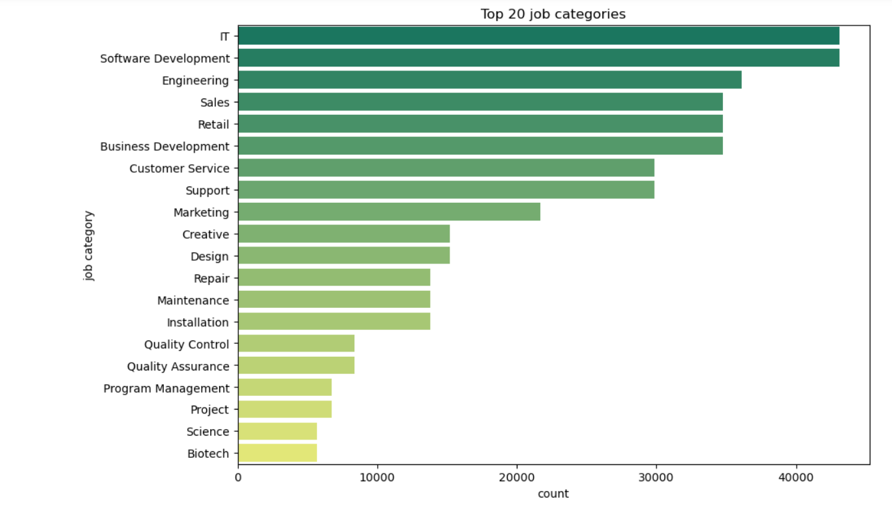
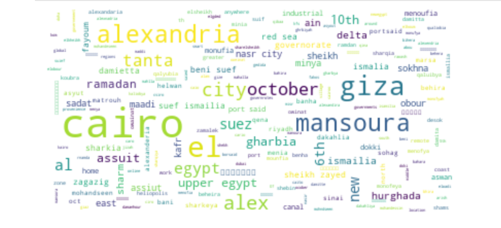
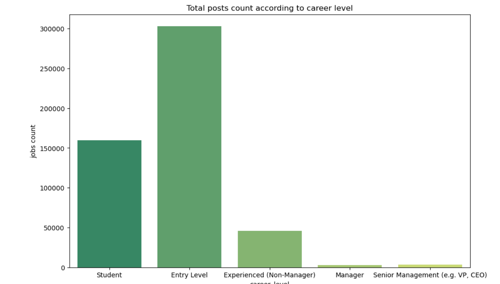
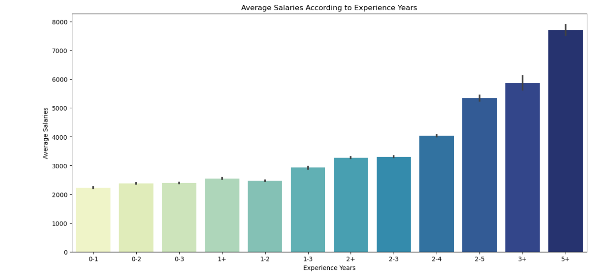

# Wuzzaf Job Posts Exploratory Analysis
Clean and Explore job applications dataset on WUZZUF from 2014 to 2016.

## Project Description 
In the dynamic world of online job marketplaces, achieving a harmonious equilibrium between job supply and demand is an enduring challenge. At WUZZUF, our primary goal is to optimize the platform for demand, relevance, and quality. We facilitate connections between employers and prospective applicants, and curate relevant job recommendations for job seekers.

To gain deeper insights into this complex ecosystem, we are embarking on a data-driven project. We will be analyzing a dataset derived from WUZZUF, which spans the years 2014 to 2016, focusing on job posts and their corresponding applications.

It is important to note that while the majority of jobs are centered in Egypt, the dataset also encompasses positions from other locations. 

## Data source
link on kaggle: https://www.kaggle.com/datasets/WUZZUF/wuzzuf-job-posts
 

## Dataset Context

This dataset contains a sample of job postings that were published on the WUZZUF platform during the period of 2014-2016. 

 <b>Columns Overview:</b> 

    
* **id**: Unique job ID.
* **city**: Job location.
* **job_title**: Job name.
* **job_category1**, job_category2, job_category3: Job categories or fields.
* **job_industry1**, job_industry2, job_industry3: Job industries or sectors.
* **salary_minimum** and salary_maximum: Salary range.
* **num_vacancies**: Number of job openings.
* **career_level**: Job seniority.
* **experience_years**: Required experience.
* **post_date**: Posting date.
* **views**: Number of times the job was viewed.
* **job_description**: Description of the job.
* **job_requirements**: Qualifications needed.
* **payment_period**: Salary payment frequency.
* **currency**: Currency used for salaries.    

 

## Some Insights 

The insights generated from this exploration will not only enhance our understanding of the WUZZUF job marketplace but also inform strategies for improving user experiences, growing the platform, and contributing to the broader employment ecosystem.

#### getting trending job categories.
  

#### Most active cities in jobs.
  

#### Which career level is the most?
  

#### Average Salaries increasing exponentially per experience years.
   
##
#### Note: you can check other insights in the [Notebook](https://github.com/momedhat/Wuzzaf-Job-Posts-EDA/blob/main/wuzzaf_explore.ipynb).
